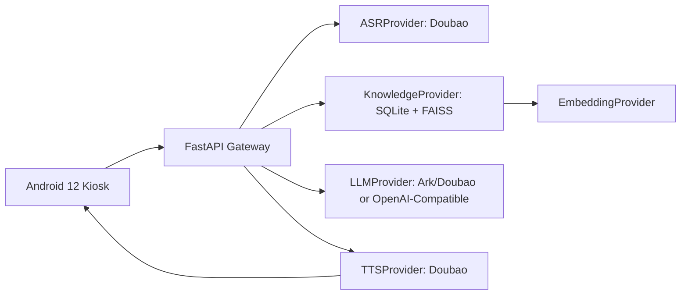

# MVP Architecture

Updated: 2026-08-06

## Current Route

Phase 1 builds the Android large-screen AI voice customer-service MVP:

```text
Android idle video
-> tap/record
-> Gateway audio upload
-> Doubao ASR
-> lightweight RAG Top-K retrieval
-> Doubao/Volcengine Ark or OpenAI-compatible LLM grounded answer
-> Doubao TTS
-> Android playback and subtitles
-> idle video
```
LiveTalking, Wav2Lip, MuseTalk, realtime lip sync, WebRTC digital human and GPU inference are deferred.

## System Components



## Android Client

- Landscape immersive kiosk shell.
- Local idle character video and offline fallback.
- USB/default microphone recording.
- Speaker playback and subtitles.
- No provider secrets, model weights or business source files.
- Final hardware acceptance is TASK-015.

## Gateway

- FastAPI HTTP API.
- Request IDs and sanitized logs.
- Provider adapters for ASR, TTS, LLM, Embedding and Knowledge.
- Temporary audio handling by `audio_id`.
- SQLite knowledge metadata and status.
- FAISS vector retrieval in TASK-012.

## Knowledge

- Only explicitly selected reviewed Markdown/TXT/PDF/DOCX files.
- Status values: `approved`, `draft`, `rejected`.
- Customer answers use `approved` sources only.
- Return `sources` and `request_id`.
- Unknown, price, inventory, activity and medical-effect questions must transfer to staff when not supported by approved context.

## Task Route

```text
TASK-008 Gateway + Provider skeleton
-> TASK-009 real Doubao TTS
-> TASK-010 real Doubao ASR
-> TASK-011 real LLM + Embedding API
-> TASK-012 lightweight RAG
-> TASK-013 Android end-to-end voice loop
-> TASK-014 Tencent Cloud deployment
-> TASK-015 Android large-screen acceptance
-> future LiveTalking digital human upgrade
```
