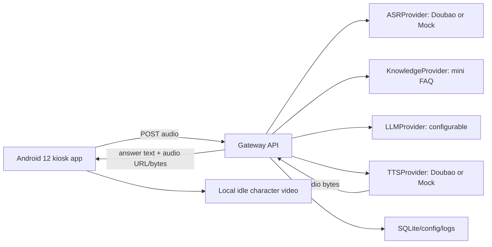

# MVP Architecture

Updated: 2026-08-06

## Decision

Phase 1 no longer depends on LiveTalking, Wav2Lip, MuseTalk, realtime lip sync, WebRTC avatar streaming or GPU inference. Those capabilities are deferred to a later enhancement phase.

The Phase 1 MVP is:

```text
Android 12 large screen
-> local idle character video
-> tap to start consultation
-> USB/default microphone recording
-> Gateway upload
-> Doubao ASR
-> mini FAQ retrieval
-> LLM grounded answer
-> Doubao TTS
-> Android audio playback plus subtitles
-> return to idle
```

## Goals

- Ship a minimum store-ready voice FAQ assistant for Android 12 large displays.
- Keep the experience useful without GPU, WebRTC or realtime avatar inference.
- Keep all provider secrets on the server.
- Keep the knowledge base deliberately small: 10-30 human-approved FAQ entries.
- Preserve future LiveTalking integration through adapter boundaries and display-mode configuration.

## Non-Goals

- No LiveTalking runtime in Phase 1.
- No Wav2Lip/MuseTalk assets or model downloads.
- No Dify, vector database, bulk raw-material ingestion or complex admin backend.
- No always-on wake word.
- No medical diagnosis, price promises, inventory promises or unsupported treatment claims.

## Components



## Runtime Topology

- Android app runs on the store large display.
- Gateway runs on Tencent Cloud 8C/4G/10M CPU server or local development machine.
- Doubao ASR/TTS and LLM provider calls are server-side only.
- FAQ data is a reviewed YAML/JSON file in the repository or an operator-provisioned server file.
- Audio uploads are bounded, temporary and deleted after processing unless a task explicitly approves retention.

## Data Flow

1. Android starts in `idle`.
2. Local idle character video loops from bundled/provisioned storage.
3. User taps start.
4. Android records from preferred USB microphone or default input.
5. Android uploads audio with `session_id`, `request_id`, audio metadata and app/device version.
6. Gateway normalizes/validates audio.
7. ASR provider returns transcript.
8. Knowledge provider retrieves approved FAQ matches.
9. LLM provider generates a concise answer grounded in retrieved FAQ context.
10. TTS provider returns Android-playable audio.
11. Android displays transcript/answer subtitles and plays audio.
12. Android returns to idle.

## Reliability Model

- Android never shows a blank screen: idle video continues during network/provider failure.
- Gateway returns structured errors with user-safe messages.
- Every request has a `request_id` across Android, Gateway and provider logs.
- Provider calls use timeouts, finite retries and cost guards.
- Unknown knowledge questions return controlled fallback or transfer-to-human wording.

## Extension Points

- `DisplayMode`: `idle_video_voice` now, `livetalking_webrtc` later.
- `ASRProvider`, `LLMProvider`, `TTSProvider`, `KnowledgeProvider` isolate vendors.
- LiveTalking can later consume the same final answer/audio through a rendering adapter.
